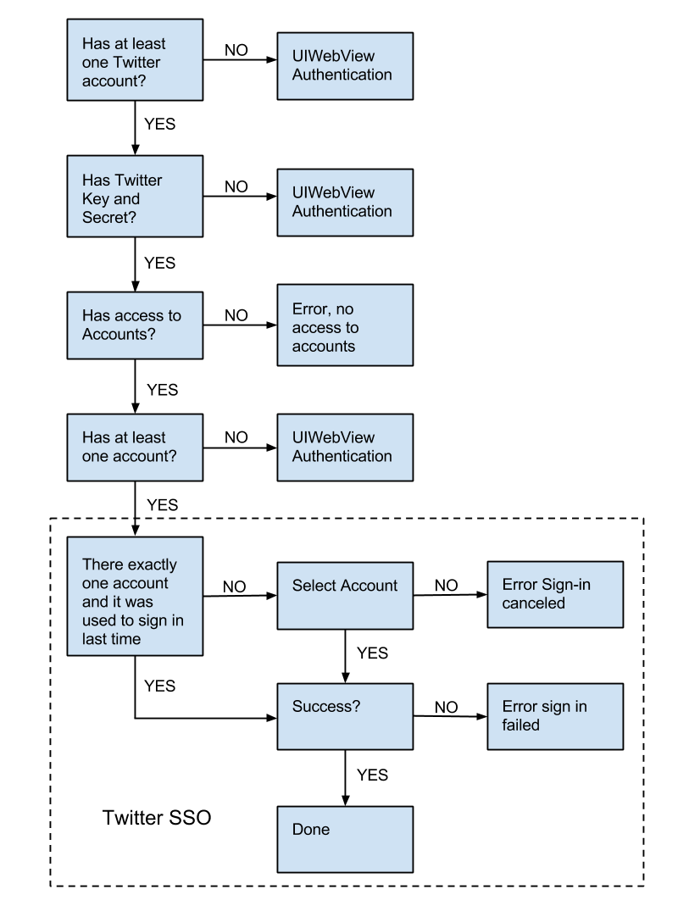

# Native Authentication Guide

This guide describes the process of integrating with native iOS authentication systems. The Social Sign-in library has historically supported authentication by means of a UIWebView running a traditional web OAuth flow. Support is now introduced for authentication by means of native identity-provider libraries.

## Supported Providers
- Facebook
- Google+
- Twitter

Native Authentication is supported by the library, and is compatible with both Social Sign-in only and User Registration deployments.
At this time, native-authentication is available for authentication only, and not for social-identity-resource authorization (e.g. sharing.)
The SDK is not currently able to request the same scopes that are configured in the Engage dashboard when using Native Authentication. This will be available in a future release. For the time being Facebook requests basic_info and Google+ requests plus.login.

## 10,000′ View
1. Configure the native authentication framework
2. Start User Registration sign-in or Social Sign-in authentication
3. The library will delegate the authentication to the native authentication framework
4. The library delegate message will fire when native authentication completes

## Facebook

### Configure the Native Authentication Framework

Follow the Facebook iOS SDK integration instructions. For native Facebook authentication to work via Social Sign-in both Janrain and the Facebook iOS SDK must be configured to use the same Facebook application.
Make sure that you use the same Facebook app ID as is configured in your application’s dashboard.

### Ensure that the Facebook sources are linked
Add the `-ObjC` flag to the app target’s build settings: https://developer.apple.com/library/mac/qa/qa1490/_index.html

### Handle the Facebook login callback

When authenticating the Facebook SDK will pass control to the Facebook iOS app or to Facebook in a mobile browser. Your app will need to handle the callback to finish signing in. Add the following to your application delegate:

    - (BOOL)application:(UIApplication *)application openURL:(NSURL *)url sourceApplication:(NSString *)sourceApplication
             annotation:(id)annotation
    {
        return [JREngage application:application openURL:url sourceApplication:sourceApplication annotation:annotation];
    }

It is possible that the redirect back to you app may be interrupted. If that happens the Janrain iOS SDK can do some cleanup and put your application in a position to restart the authentication. Add the following to your application delegate:

    - (void)applicationDidBecomeActive:(UIApplication *)application
    {
        [JREngage applicationDidBecomeActive:application];
    }

### Begin Sign-In or Authentication

Start authentication or sign-in as normal. If the Facebook iOS SDK is compiled into your app, it will be used to perform all Facebook authentication.

### Signing Out

Following Facebook’s documentation we’ll use `closeAndClearTokenInformation` to close the in-memory Facebook session.

In your view controller import the Facebook SDK

    #import <FacebookSDK/FacebookSDK.h>

Call `closeAndClearTokenInformation` when your sign-out button is pressed. For example, in the SimpleCaptureDemo, we add
the following to the signOutCurrentUser method of the RootViewController.

    - (void)signOutCurrentUser
    {
        ...

        // Sign out of the Facebook SDK
        [FBSession.activeSession closeAndClearTokenInformation];
    }

Note: This does not revoke the applications access to Facebook. So if a user has a Facebook account set up in their iOS
device’s Settings app it will continue to be used to sign in without asking to be reauthorized.

## Google+

### Configure the Native Authentication Framework
Follow the Google+ platform getting started guide. For native Google+ authentication to work via Social Sign-in both Janrain and the Google+ iOS SDK must be configured to use the same Google+ project in the Google Cloud Console.

### Configure the Janrain SDK

If you are using Janrain’s user registration add your iOS Google+ client ID to your JRCaptureConfig instance:

    config.googlePlusClientId = @"YOUR_CLIENT_ID";

If you are using social sign-in only, after your call to `+[JREngage setEngageAppId:tokenUrl:andDelegate:]` set your Google+ client ID:

    [JREngage setGooglePlusClientId:@"YOUR_CLIENT_ID"

### Handle the Google+ login callback

When authenticating the Google+ SDK may pass control to Google+ in a mobile browser. Your app will need to handle the callback to finish signing in. Add the following to your application delegate:

    - (BOOL)application:(UIApplication *)application openURL:(NSURL *)url sourceApplication:(NSString *)sourceApplication
             annotation:(id)annotation
    {
        return [JREngage application:application openURL:url sourceApplication:sourceApplication annotation:annotation];
    }

It is possible that the redirect back to you app may be interrupted. If that happens the Janrain iOS SDK can do some cleanup and put your application in a position to restart the authentication. Add the following to your application delegate:

    - (void)applicationDidBecomeActive:(UIApplication *)application
    {
        [JREngage applicationDidBecomeActive:application];
    }

### Begin Sign-In or Authentication

Start authentication or sign-in as normal. If the Google+ iOS SDK is compiled into your app, it will be used to perform all Google+ authentication.

### Signing out and disconnecting from the Google+ SDK

Follow the directions in https://developers.google.com/+/mobile/ios/sign-in under “Sign out the user” and “Revoking access tokens and Disconnecting the app”.

## Twitter

### Configure the Janrain SDK

Ensure that you have Accounts.framework, Social.framework linked to your target.

If you are using Janrain’s user registration add your Twitter consumer key and consumer secret to your JRCaptureConfig instance:

	config.twitterConsumerKey = @"YOUR_CONSUMER_KEY";
    config.twitterConsumerSecret = @"YOUR_CONSUMER_SECRET";

or if you are using social sign-in only, after your call to `+[JREngage setEngageAppId:tokenUrl:andDelegate:]` set your Twitter consumer key and consumer secret:

    [JREngage setTwitterConsumerKey:@”YOUR_CONSUMER_KEY
                          andSecret:@”YOUR_CONSUMER_SECRET”];

Make sure that your Twitter consumer key and consumer secret match what you have configured in the Engage dashboard.

When a user has not given your application permission to access the Twitter accounts, then the `-[engageSignInDidFailWithError:]` method of your JRCaptureDelegate or the `-[authenticationDidFailWithError:forProvider:]` method of  your `JREngageSigninDelegate` will be called with an error. You can handle the error by checking to see if it’s code is `JRAuthenticationNoAccessToTwitterAccountsError`. For example:

    #import "JREngageError.h"
    ...
        - (void)engageSignInDidFailWithError:(NSError *)error
        {
            DLog(@"error: %@", [error description]);
            if (error.code == JRAuthenticationNoAccessToTwitterAccountsError) {
                NSString *message = @"We weren't granted access to your accounts. "
                                @"Please change your Twitter settings.";
                UIAlertView *alertView = [[UIAlertView alloc]
                    initWithTitle:@"Twitter Error"
                              message:message
                             delegate:nil
                    cancelButtonTitle:@"Dismiss"
                    otherButtonTitles:nil];
                [alertView show];
            }
        }

### Begin Sign-in or Authentication

Begin sign-in as usual and it will follow the below flow diagram.

**Note:** The iOS 6 simulator does not behave correctly with `+[SLComposeViewController isAvailableForServiceType:]` which is used to determine if there is at least one Twitter account in the first set of the diagram.

